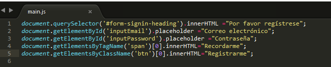

# traduccion-formulario

1. En el primero aplico el querySelector y  llamo mediante el id (#form-signin-heading)  esto lo llamará. Luego cambiamos el valor  poniéndolo en español.
2. El segundo lo llamo mediante el getElementById, como el id es único no habrá problema, seguido ponemos placeholder para que cambie el interior. Luego  cambiamos de valor a español.
3. El tercero ´vuelvo a llamarlo con el id seguido placeholder y cambio su valor a español.
4. Lo llamo con el getElementsByTagName llamando al span, podríamos llamarlo con el id o class pero, en el ejemplo el span no tiene id ni class(aparte el html no se modifica).Así que lo llamamos con el TagName seguido ponemos [0] ya que si existiera  varios span ,nosotros eligimos a cual queremos llamar en este caso es [0]. Luego cambiamos su valor a español.
5.  Casi igual que el anterior pero en este caso lo llamamos mediante una clase, támbien pudo haber sido mediante un tag o id nos daría el mismo resultado , támbien ponemos [0] para indicar que queremos el primer boton que tenga la posición 0 y le cambiamos de valor a español.

